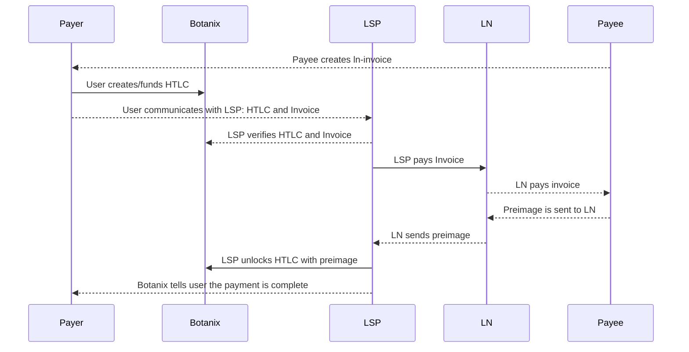

# Lightning EVM Bridge

This is a project to create a trust minimized bridge between EVM chains and the Lightning Network. The goal is to allow for the creation of smart contracts that can make trust minimized payments to the Lightning Network. This really only makes sense in the context of chains using Bitcoin as their native currency, but it could be extended to other chains as well.

⚙️ Built using NextJS, RainbowKit, Hardhat, Wagmi, Viem, and Typescript, and LND.

## Contents

- [Project Structure](#project-structure)
- [Payment Flow](#payment-flow)
- [Requirements](#requirements)
- [Getting Started](#getting-started)
- [Deploying Smart Contracts](#deploying-your-smart-contracts-to-a-live-network)
- [Running in Production](#running-in-production)
- [Future Work](#future-work)
- [Contributing](#contributing)

## Project Structure

There are three main parts to this project:

<!-- Make a table with links to each folder -->

| Folder                                  | Description                                                                                                                           |
| --------------------------------------- | ------------------------------------------------------------------------------------------------------------------------------------- |
| [Contracts](./packages/foundry)         | This is where the smart contracts live                                                                                                |
| [Frontend](./packages/nextjs)           | This is the frontend of the app built using Scaffold-Eth 2                                                                            |
| [Lightning server](./packages/server)   | This is the lightning service provider websocket who is paying the invoices, this connects to your lightning node (is not one itself) |
| [Relay server](./packages/relay-server) | This is the server that tries to claim the HTLC on behalf of the user who has no gas to recieve his payment                           |

## Payment Flow



## Requirements

Before you begin, you need to install the following tools:

- [Node (v18 LTS)](https://nodejs.org/en/download/)
- Yarn ([v1](https://classic.yarnpkg.com/en/docs/install/) or [v2+](https://yarnpkg.com/getting-started/install))
- [Docker](https://www.docker.com/products/docker-desktop)
- [Docker Compose](https://docs.docker.com/compose/install/)
- [Foundry](https://book.getfoundry.sh/)

## Getting Started

#### Lightning Setup and Wallet Setup

This step is half optional. I provided you 3 options for running the lightning server:

A. You can run your own lightning node and server.

B. You can connect to my node and websocket server, so no nead to run any lightning stuff.

C. Run the lightning server in 'MOCK' mode, which will simulate the lightning server.

To set up, A, your own server:

**Disclaimer: this is using REAL lightning network sats because it is just easier and more stable to do so. Do not put more than you are willing to lose.**

1. You must have a lightning node running. I am using voltage which has a 20 day free trial to host your own node: [Voltage](https://voltage.cloud/).

2. Back up your seed and store it in a safe place.

3. Fund your node with some sats and fund your channel. I recommend opening a channel with someone well connected because it has higher chances of payment success.

Generate a new botanix wallet, store the hex private key somewhere safe, and fund it with some testnet sats.

#### Running Locally (A)

3. Clone this repo & install dependencies

```
git clone https://github.com/diyahir/lightning-dapp.git
cd lightning-dapp
yarn install
```

2. Copy the `sample.env` file in the root of the server and nextjs packages. Rename it to `.env` and fill in the required values.

3. Start the services

```
docker-compose up -d --build
```

or using docker build and run the images separately

```
docker build -f packages/nextjs/Dockerfile . -t botanix-ln-webapp
docker build -f packages/server/Dockerfile . -t botanix-ln-server
```

Alternatively:

Run the webapp in the first terminal:

```
yarn start
```

Run a local LSP server relayer in a second terminal

```
yarn server
```

#### Running Locally (B: Only Webapp, My Server)

1. Clone this repo & install dependencies

```
git clone https://github.com/diyahir/lightning-dapp.git
cd lightning-dapp
yarn install
```

2. Copy the `sample.live.env` file in the root of the nextjs package. Rename it to `.env`.

3. Start the webapp

```
yarn start
```

#### Running Locally (C: Mock Server)

Same as A, no need to do any lightning setup, but in the server `.env` file, set

```
LND_MACAROON=""
LND_SOCKET=""
```

This will run the server in mock mode.

## Deploying Smart Contracts

To test the smart contracts

```bash
yarn foundry:test
```

Once you are ready to deploy your smart contracts, there are a few things you need to adjust.

1. Select the network

By default, `yarn deploy` will deploy the contract to the local network. You can change the defaultNetwork in `packages/hardhat/hardhat.config.ts.` You could also simply run `yarn deploy --network target_network` to deploy to another network.

Check the `hardhat.config.ts` for the networks that are pre-configured. You can also add other network settings to the `hardhat.config.ts file`. Here are the [Alchemy docs](https://docs.alchemy.com/docs/how-to-add-alchemy-rpc-endpoints-to-metamask) for information on specific networks.

Example: To deploy the contract to the Sepolia network, run the command below:

```
yarn deploy --network sepolia
```

2. Generate a new account or add one to deploy the contract(s) from. Additionally you will need to add your Alchemy API key. Rename `.env.example` to `.env` and fill the required keys.

```
ALCHEMY_API_KEY="",
DEPLOYER_PRIVATE_KEY=""
```

The deployer account is the account that will deploy your contracts. Additionally, the deployer account will be used to execute any function calls that are part of your deployment script.

You can generate a random account / private key with `yarn generate` or add the private key of your crypto wallet. `yarn generate` will create a random account and add the DEPLOYER_PRIVATE_KEY to the .env file. You can check the generated account with `yarn account`.

3. Deploy your smart contract(s)

Run the command below to deploy the smart contract to the target network. Make sure to have some funds in your deployer account to pay for the transaction.

```
cd packages/foundry
yarn deployWithGasPrice --network botanixTestnet
```

4. Verify your smart contract

You can verify your smart contract on Etherscan by running:

```
yarn verify --network network_name
```

eg: `yarn verify --network sepolia`

This uses [etherscan-verify from hardhat-deploy](https://www.npmjs.com/package/hardhat-deploy#4-hardhat-etherscan-verify) to verify all the deployed contracts.

You can alternatively use [hardhat-verify](https://hardhat.org/hardhat-runner/plugins/nomicfoundation-hardhat-verify) to verify your contracts, passing network name, contract address and constructor arguments (if any): `yarn hardhat-verify --network network_name contract_address "Constructor arg 1"`

If the chain you're using is not supported by any of the verifying methods, you can add new supported chains to your chosen method, either [etherscan-verify](https://www.npmjs.com/package/hardhat-deploy#options-2) or [hardhat-verify](https://hardhat.org/hardhat-runner/plugins/nomicfoundation-hardhat-verify#adding-support-for-other-networks).

**Make sure your `packages/nextjs/scaffold.config.ts` file has the values you need.**

## Running in Production

To run the app in production, you need to build the app and run the server.

1. Do all the steps in the [Deploying your Smart Contracts to a Live Network](#deploying-your-smart-contracts-to-a-live-network) section.

2. Do all the steps in the [Lightning Setup](#lightning-setup) section.

3. Pull the latest changes set your .env files and run the following commands:

```
docker-compose up -d --build
```

4. Run a Nginx server to serve the app, refer to the `example.nginx.config` file in the root of the project. This will require you to have a domain and a SSL certificate.

5. Set your DNS to point to the server.

6. Enjoy your app running in production.

### Future Work

- [ ] Server funds rebalancing (cycle funds from the evm chain to the lightning network channel)
- [ ] Add support to receive payments from the lightning network to the evm chain
- [ ] Create proper database for the server
- [ ] Add ability to change LSP
- [ ] Integrate service fee for the LSP
- [ ] Preconfirmations from the LSP before user pays on-chain
- [ ] Indexing payments to provide most recent history
- [ ] Relay server for unlocking HTLCs

### Disabling Github Workflow

We have github workflow setup checkout `.github/workflows/lint.yaml` which runs types and lint error checks every time code is **pushed** to `main` branch or **pull request** is made to `main` branch

To disable it, **delete `.github` directory**

## Contributing

We welcome contributions to the lightning dapp.

Please see [CONTRIBUTING.MD](https://github.com/scaffold-eth/scaffold-eth-2/blob/main/CONTRIBUTING.md) for more information and guidelines for contributing to the lightning dapp.

## Acknowledgements

Special thanks to:

- Scaffold-eth for the base of this project
- Voltage for the lightning node service
- HTLC Solidity base which I forked and updated https://github.com/chatch/hashed-timelock-contract-ethereum
